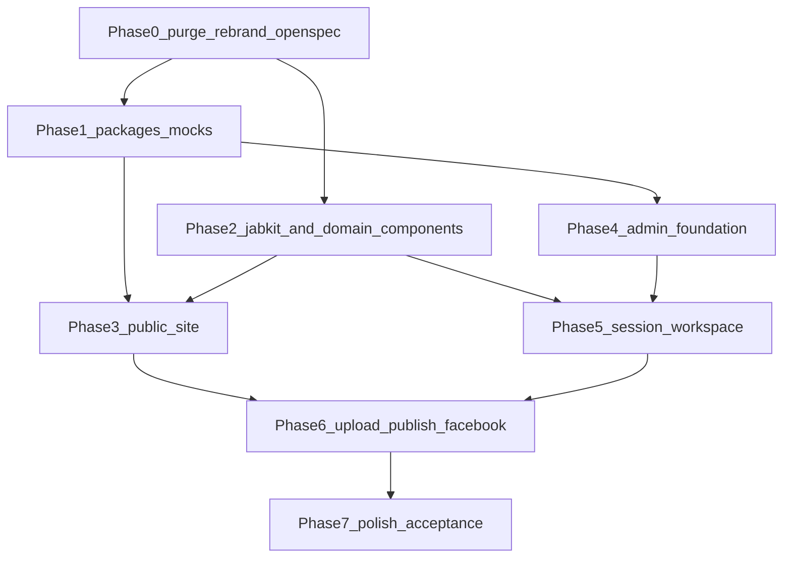

# Playmates ni José — Implementation Roadmap

This folder is the **only source of work orders** for turning the current PawPair template into a working **Playmates ni José** prototype.

A later subagent will split [`99-ticket-index.md`](99-ticket-index.md) into tickets. Do not invent extra phases. Do not implement a real database, Google OAuth, Drive upload, or YouTube upload. Those are explicitly left to the human owner.

## What “done” means

When every ticket in this roadmap is complete, José can open two running apps:

| App | Port | What works |
|---|---|---|
| `apps/web` | 9000 | Public archive: home, sessions, games, players, venues — all from mock data |
| `apps/admin` | 9001 | Session workspace: create session, roster, import files, organize into games/sides/parts, assign matchups, simulate Drive+YouTube upload, generate Facebook copy, publish so the public site updates |

The prototype must be **clickable and stateful** (admin mutations persist in the in-memory mock store for the Node process). It must **not** write video bytes anywhere.

## Confirmed decisions (do not reopen)

1. **Hybrid UI.** JabKit CLI for public-site marketing/visual blocks. `@fe-template/ui` for admin primitives (`DataTable`, `Form`, `Dialog`, `Sheet`, `Sidebar`, `Command`, `Progress`, `Empty`, `FileUploader`, `Skeleton`, `Badge`, `Tabs`).
2. **OpenSpec.** Real tool: `npx @fission-ai/openspec@latest`. Not the empty `openspec` npm package (that is `0.0.0` and unused).
3. **Delete PawPair pages.** Strip marketing pages down to the layout/providers shell, then build Playmates routes.
4. **Mocks.** New workspace `packages/mocks` with typed fixtures + an in-memory repository. Same async signatures a future Prisma adapter will use.
5. **Auth.** Keep Supabase client/middleware. Add `MOCK_AUTH=true` so admin is reachable without a database.
6. **No database work.** Do not create Prisma models, migrations, or RLS. [`11-handoff-to-real-data.md`](11-handoff-to-real-data.md) lists the seams the owner will wire later.
7. **Keep `@fe-template/*` package names.** Do not rename to `@playmates/*`.

## How to read this folder

Read in this order before writing any ticket or code:

1. This file.
2. [`00-conventions.md`](00-conventions.md) — rules a dumb agent must not violate.
3. The phase file for the ticket you are executing.
4. The product docs named in that ticket’s **Read first** line.
5. [`99-ticket-index.md`](99-ticket-index.md) — dependency graph.

| File | Purpose |
|---|---|
| [00-conventions.md](00-conventions.md) | Paths, naming, JabKit vs `@fe-template/ui`, CLI recipe, forbidden actions |
| [01-openspec.md](01-openspec.md) | `openspec init` + 10 capability specs |
| [02-metadata.md](02-metadata.md) | `{Component}.meta.ts` + Next.js SEO metadata |
| [03-phase-0-purge-and-rebrand.md](03-phase-0-purge-and-rebrand.md) | Delete PawPair, rebrand chrome, auth bypass, ADR revision |
| [04-phase-1-mock-data-layer.md](04-phase-1-mock-data-layer.md) | `packages/mocks` types, seed, repositories, upload simulator |
| [05-phase-2-component-library.md](05-phase-2-component-library.md) | JabKit install list + domain components |
| [06-phase-3-public-site.md](06-phase-3-public-site.md) | Public routes and sections |
| [07-phase-4-admin-foundation.md](07-phase-4-admin-foundation.md) | Admin shell, dashboard, players, venues, sessions CRUD |
| [08-phase-5-session-workspace.md](08-phase-5-session-workspace.md) | 7-step workspace; organize board split into 5 tickets |
| [09-phase-6-upload-publish-facebook.md](09-phase-6-upload-publish-facebook.md) | Mocked uploads, publish, Facebook drafts |
| [10-phase-7-polish-and-acceptance.md](10-phase-7-polish-and-acceptance.md) | States, Storybook, MVP walkthrough |
| [11-handoff-to-real-data.md](11-handoff-to-real-data.md) | What the owner wires later — do not implement |
| [99-ticket-index.md](99-ticket-index.md) | Flat `PNJ-###` table for the splitting subagent |

## Phase dependency graph



Phase 3 (public) and Phase 4 (admin foundation) may run in parallel after Phase 1. Phase 5 needs Phase 2 domain components **and** Phase 4 session list/create. Phase 6 needs both a public site that respects `visibility` and a workspace that can emit publish actions.

## How a splitting subagent must work

1. Read [`99-ticket-index.md`](99-ticket-index.md). That table is the full ticket list. Do not invent `PNJ-###` numbers.
2. For each row, copy the full ticket body from the matching phase file. Every `PNJ-###` heading in a phase file is the ticket.
3. One ticket = one work item. Do not merge tickets unless two tickets share the exact same **Create** path and the smaller one is marked **Size** XS.
4. Preserve **Depends on**, **Do not touch**, **Validate**.
5. If a ticket says “leave wiring to the owner”, do not add a follow-up ticket that wires Prisma or OAuth.

## Ticket body format (canonical)

Every ticket in this folder uses this shape. Splitting agents must keep every field.

```markdown
### PNJ-000 — Short title
**Phase** N · **Depends on** PNJ-000 · **Size** S|M|L|XL
**Read first:** path, path
**Create:** exact files to add
**Edit:** exact files to change
**Delete:** exact files/folders to remove (or “none”)
**Do not touch:** paths that are out of scope
**Steps:**
1. Concrete action
2. Concrete action
**Acceptance:**
- Observable behavior a reviewer can click or grep
**Validate:** `pnpm lint && pnpm --filter <name> typecheck`
```

Size guide: **XS** < 30 minutes, **S** one file cluster, **M** one route or one component family, **L** a multi-file feature, **XL** the organize board or mock store core.

## Product docs the tickets already point at

Do not load every file in `docs/`. Tickets name the ones that matter. The usual set:

- [`docs/02-domain/domain-model.md`](../docs/02-domain/domain-model.md)
- [`docs/03-data/database-schema.md`](../docs/03-data/database-schema.md) — types only; do not migrate
- [`docs/04-workflows/session-to-publish.md`](../docs/04-workflows/session-to-publish.md)
- [`docs/06-ui/information-architecture.md`](../docs/06-ui/information-architecture.md)
- [`docs/06-ui/public-site.md`](../docs/06-ui/public-site.md)
- [`docs/06-ui/admin-session-workspace.md`](../docs/06-ui/admin-session-workspace.md)
- [`docs/01-product/business-rules.md`](../docs/01-product/business-rules.md)
- [`docs/01-product/naming-conventions.md`](../docs/01-product/naming-conventions.md)
- [`docs/08-implementation/mvp-acceptance-criteria.md`](../docs/08-implementation/mvp-acceptance-criteria.md)
- [`docs/llm/PATTERNS.md`](../docs/llm/PATTERNS.md)

## Validation bar (every ticket)

Before marking a ticket complete:

```bash
pnpm lint
pnpm typecheck
```

If the ticket touched `apps/web` or `apps/admin`, also run the scoped typecheck named in the ticket. Do not claim a UI ticket complete from a screenshot alone. Click the flow described in **Acceptance**.

## Out of scope for this entire roadmap

- Prisma schema for Playmates, migrations, RLS, seeds in `packages/db`
- Real Google OAuth, Drive resumable upload, YouTube Data API
- Facebook Graph API posting
- Storing video files in Supabase Storage
- Renaming workspace packages
- Introducing a second design system besides JabKit + `@fe-template/ui`
- AI pairing, stats, scores, highlights, playlists
