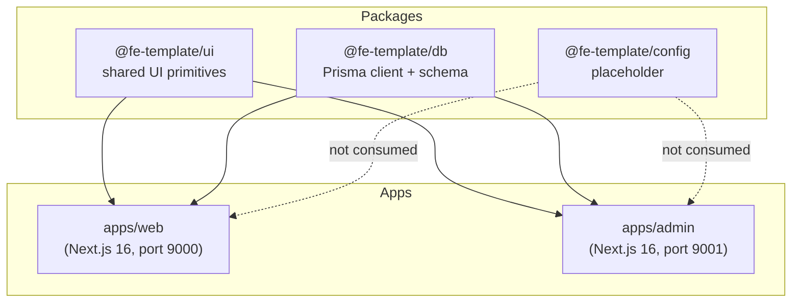

# Repository Architecture — fe-multi-web-template

High-level architecture of the monorepo: workspace graph, dependency flow, data flow, and tooling boundaries.

---

## Workspace graph



- `apps/web` and `apps/admin` both consume `@fe-template/ui` and `@fe-template/db`.
- `@fe-template/config` is a placeholder and has no code or consumers.
- Packages do not depend on each other.

---

## App responsibilities

| App | Primary users | Main responsibilities |
|---|---|---|
| `apps/web` | Public visitors | Marketing site: home, about, pricing, blog, contact, showcase. Composes page sections. Fetches data via internal API routes and React Query. |
| `apps/admin` | Internal admins | Admin portal: dashboard, user management, pets, posts CMS, testimonials, contacts, pricing plans. Uses Supabase Auth, Prisma Server Components, and Server Actions. |

---

## Rendering model

| App | Router | Default component type | Server rendering |
|---|---|---|---|
| `apps/web` | Next.js App Router | Server Components by default; client components marked `"use client"` | Pages are Server Components that compose sections. Internal API routes query Prisma for static-ish data. |
| `apps/admin` | Next.js App Router | Server Components by default; client components marked `"use client"` | Dashboard pages are async Server Components that query `prisma` directly. Forms/tables are client components. |

---

## Data flow

### `apps/web`

```text
Prisma (packages/db) → API routes (apps/web/src/app/api/*) → React Query (apps/web/src/hooks/use-*/client.ts) → sections/pages
```

- API routes are the only places that import `prisma` from `@fe-template/db` in `apps/web`.
- Hooks split into `client.ts` (React Query) and `server.ts` (server-side fetch with ISR revalidation).
- No Server Actions in `apps/web`.

### `apps/admin`

```text
Server Components (prisma direct) → HydrationBoundary → Client tables/forms
Server Actions (apps/admin/src/app/**/actions.ts) → prisma → revalidatePath
```

- Server Components prefetch queries and pass them to `HydrationBoundary`.
- Mutations happen in route-colocated `actions.ts` files that call `prisma` or Supabase admin and then `revalidatePath`.
- `middleware.ts` refreshes the Supabase session and gates routes.

---

## Authentication

Authentication is implemented only in `apps/admin`.

| Piece | Path | Role |
|---|---|---|
| Middleware | `apps/admin/middleware.ts` | Refresh session; redirect unauthenticated visitors to `/login`; redirect authenticated visitors away from `/login`, `/signup`, `/otp` to `/dashboard`. |
| Browser client | `apps/admin/src/lib/supabase/client.ts` | Login, signup, OTP, sign-out forms. |
| Server client | `apps/admin/src/lib/supabase/server.ts` | Server Components / Server Actions that need auth context. |
| Service role client | `apps/admin/src/lib/supabase/admin.ts` | Invite users via Supabase admin API. |
| Profile upsert | `apps/admin/src/modules/auth/otp-form/actions.ts` | Creates a `Profile` row after OTP confirmation. |

Known boundary: middleware currently gates on session presence only. A `TODO` in `middleware.ts` notes that `User.role === ADMIN` enforcement via Prisma is not yet wired.

---

## State management

| App | State tool | Scope |
|---|---|---|
| `apps/web` | Redux Toolkit | Theme slice (source of truth synced to `next-themes`). |
| `apps/web` | TanStack Query | Server-state caching for blog, pricing, testimonials. |
| `apps/admin` | TanStack Query | Server-state caching for users, pets, posts, contacts, testimonials, pricing plans. |
| `apps/admin` | `next-themes` | Theme toggling only. No Redux. |

See `docs/state-management.md` for details.

---

## Shared package boundaries

### `@fe-template/ui`

- Ships TypeScript/TSX source. No build step.
- Apps transpile it via `transpilePackages: ["@fe-template/ui"]` in `next.config.ts`.
- Tailwind must scan it via `@source "../../../../packages/ui/src/**/*.{ts,tsx}"` in each app's `globals.css`.
- Public exports are defined in `packages/ui/src/index.ts`. Add a new export there when adding a component.

### `@fe-template/db`

- Ships TypeScript source. No build step except Prisma client generation.
- Public entry points: `.` (re-exports `@prisma/client` + `prisma`) and `./client` (just `prisma`).
- Server-only. Never import from client components in either app.
- Multi-file Prisma schema under `packages/db/prisma/schema/`.

### `@fe-template/config`

- Placeholder. No exports, no consumers. Do not add dependencies here without a documented plan.

---

## Tooling boundaries

| Concern | Tool | Config location |
|---|---|---|
| Monorepo orchestration | Turborepo 2 | `turbo.json`, `pnpm-workspace.yaml` |
| Package manager | pnpm 11.0.8 | root `package.json` `packageManager` (not `pnpm-workspace.yaml`) |
| Lint / format | Biome 2.5.4 | `biome.json` (root) |
| App lint | ESLint 9 flat config | `apps/*/eslint.config.mjs` |
| Type checking | TypeScript | `apps/*/tsconfig.json`, `packages/*/tsconfig.json` |
| Git hooks | Husky + lint-staged | `.husky/` |
| Commits | commitlint | `commitlint.config.js` |
| Framework | Next.js 16 | `apps/*/next.config.ts`, `apps/*/package.json` |
| CSS | Tailwind CSS 4 | `apps/*/postcss.config.mjs`, `apps/*/src/app/globals.css` |
| UI primitives | Base UI + shadcn | `packages/ui/package.json` |
| Database ORM | Prisma 6 | `packages/db/package.json` |

---

## Cross-cutting concerns

- **Images**: `apps/web` uses `next/image` for raster assets; source photography is in `images/` at the repo root; runtime assets are in `apps/web/public/images/`.
- **Email templates**: Supabase Auth email HTML is versioned under `apps/admin/email-templates/` but copied into the Supabase dashboard manually; not loaded at runtime.
- **Cleanup**: `scripts/cleanup-unused.py` removes unused component folders from `apps/web` after copying the template. It does not scan `packages/ui`.
